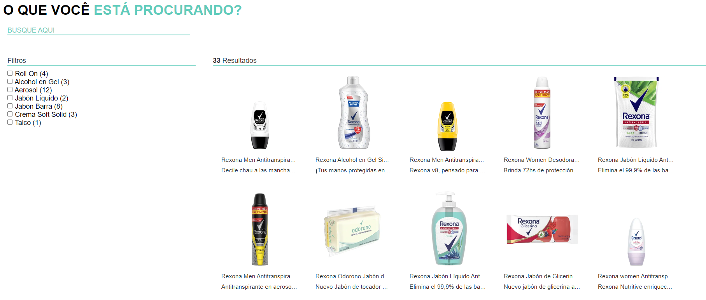

## Sobre

Sistema de localização de produtos por meio da seleção de categorias ou busca pelo nome.

## Tecnologias
- React
- Vite
- TypeScript
- Sass


```bash
1. Baixe o arquivo e descompacte-o.
2. Dentro da pasta, abra com a sua IDE de preferência.
3. No terminal, execute o comando para instalar as dependências: npm install.
4. Após a conclusão da instalação das dependências, execute o seguinte comando para iniciar a aplicação: npm run dev.
```
## Imagem do sistema

